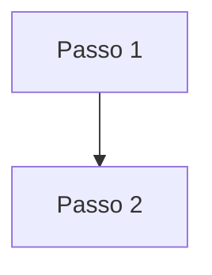

# Modelo Estória de Usuário

**Como** XXXX, **eu quero** XXXXX, **para** XXXXX.

- **Fluxo:** 

- **Perfil de acesso:** XXXXX. 

- **Testes:** [Resultados Obtidos]().

- **Status:** XXXXX. 

## Critérios de aceite
Para que seja feito o XXXXX, o portal deve se comportar conforme as critérios de aceite abaixo:

### **Critério 001 – XXXXXX:**
- **Dado** XXXXX.
- **Quando** XXXXX.
- **Então** XXXXX.

#### **Regra negocial 001.001**: 
XXXXX.

## Prototipação

- [Prototipo baixa fidelidade]()

- [Prototipo alta fidelidade]()